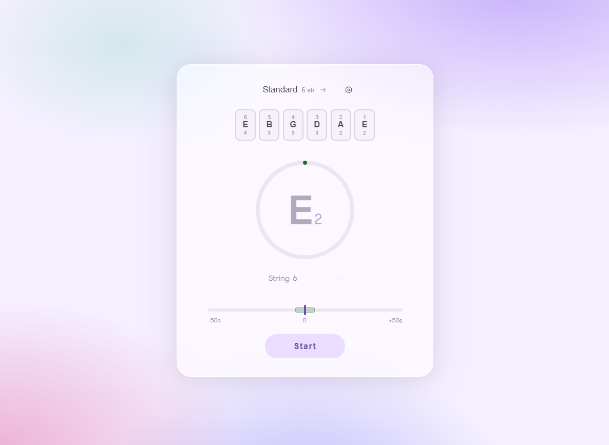

# String Tuner

**[Live Demo](https://andrianleah.github.io/String-Tuner/)**



A chromatic instrument tuner that runs in the browser and on Android. It listens to your microphone in real time, detects the pitch of the note you're playing, and tells you how many cents sharp or flat you are from the target string.

## Features

- Real-time pitch detection using the [pitchy](https://github.com/ianprime0509/pitchy) library (McLeod Pitch Method)
- Multiple instrument categories: guitar, bass, ukulele, and violin — each with tailored signal-processing parameters
- Preset tunings (Standard, Drop D, Half Step Down, Open tunings, scordatura variants, and more)
- Sequential string-by-string tuning flow — starts on the lowest/thickest string, confirms in tune, then auto-advances; tap any chip to jump to a specific string
- Visual stability ring (fills as pitch holds steady) and cents needle with opacity tied to signal confidence
- Per-string tuned status — confirmed strings are marked; tapping re-checks them
- Supports flat note display (e.g. Eb instead of D#)
- Responsive layout — fullscreen on phones and landscape, floating card on larger screens
- English, Italian, and Chinese (Simplified) UI languages
- Packaged as a native Android app via Capacitor

## Tech Stack

- [Vue 3](https://vuejs.org/) + TypeScript
- [Vite](https://vitejs.dev/)
- [Capacitor](https://capacitorjs.com/) for Android packaging
- [vue-i18n](https://vue-i18n.intlify.dev/) for localisation
- [pitchy](https://github.com/ianprime0509/pitchy) for pitch detection

## Signal Processing Architecture

The audio pipeline runs at two rates:

| Layer | Rate | Responsibility |
|---|---|---|
| Engine | ~60fps (16ms) | RMS gate, transient gate, pitchy, deliver `AudioFrame` |
| Presentation | ~30fps (33ms) | Write Vue reactive refs, update needle/ring/hint |

### Per-instrument configuration

Each instrument category has its own profile in `INSTRUMENT_CONFIGS`.
The **decay gate** applies when string RMS drops below 0.04 (quiet tail). It must always be
≤ the normal clarity gate — decaying strings produce noisier signals, so the gate must be
*more* permissive, not stricter.

| Instrument | FFT window | Stable time | Clarity gate | Decay gate |
|---|---|---|---|---|
| Bass | 8192 (~185ms) | 1500ms | 0.93 | 0.82 |
| Guitar | 2048 (~46ms) | 1100ms | 0.92 | 0.80 |
| Ukulele | 2048 | 800ms | 0.85 | 0.75 |
| Violin | 2048 | 600ms | 0.80 | 0.70 |

### Signal chain (per tick)

**Every tick (useAudioCapture):**
1. **RMS noise gate** — frames below 0.01 RMS are discarded (silence / room noise)
2. **Attack transient gate** — 80ms suppression window after a >3× RMS spike (pick attack)
3. **Low-pass filter** — always active as an audio graph node; cutoff = 3× locked string fundamental, clamped 280–2000Hz; updated per string
4. **Pitchy (primary)** — McLeod pitch detection on the primary FFT window
5. **Large-window fallback** — if primary clarity < 0.92, a secondary 8192-sample analyser is tried (guitar/ukulele/violin only; bass uses 8192 as primary)

**Happy path — pitch passes frequency window and clarity gate (useTuner):**

6. **Frequency window + clarity gate** — pitch must be within ±15% of the locked fundamental and above the instrument clarity threshold
7. **Median filter** — 22-frame rolling median (~350ms) removes transient octave errors
8. **Octave-fold correction** — if dividing by N=2–6 brings the pitch within 300¢ and improves by >400¢, use the folded value
9. **Pitch continuity gate** — discard if EMA would jump >500¢ in one tick
10. **EMA smoothing** — α=0.04 at 60fps ≈ 500ms settling time for the cents needle
11. **Hint + stability ring** — advances `stabilityProgress`; confirms the string after `stableMs` hold time

**No-signal path — pitch fails step 6 (useTuner):**

12. **Overtone fold-and-route** — if the pitch is a harmonic (N×2–6) of the locked fundamental, attempt to fold it down to the fundamental; if the folded pitch lands in the ±15% window, route it through the full stability pipeline (steps 7–11); otherwise just refresh the latch timer
13. **Coarse hint (wide window)** — active only before the string has ever entered the ±15% fine-tuning window; if pitch is within ±1 octave of the fundamental and passes the clarity gate, show a directional too-high/too-low hint without advancing stability. Suppressed if the pitch is a harmonic of an already-tuned string (sympathetic resonance)
14. **Latch-and-Fade** — display held for 500ms after the last valid frame; needle position preserved across the gap

## Running Locally

**Prerequisites:** Node.js 18+

```bash
# Install dependencies
npm install

# Start the dev server
npm run dev
```

Open [http://localhost:5173](http://localhost:5173) in your browser. The app will ask for microphone permission on first use.

```bash
# Build for production
npm run build

# Preview the production build
npm run preview
```

## Android

**Prerequisites:** Android Studio with the Android SDK installed.

```bash
# Build the web assets and sync to the Android project
npm run build
npx cap sync android

# Open in Android Studio
npx cap open android
```

The app declares the `RECORD_AUDIO` permission in `AndroidManifest.xml`, which Android requires for microphone access. The permission prompt will appear on first launch.

**Min SDK:** Android 7.0 (API 24) — **Target SDK:** API 36

## License

This project is licensed under the **MIT License** — you are free to use, copy, modify, merge, publish, distribute, sublicense, and/or sell copies of the software, provided that the original copyright notice and this permission notice are included in all copies or substantial portions of the software.

See the [LICENSE](LICENSE) file for the full text.

